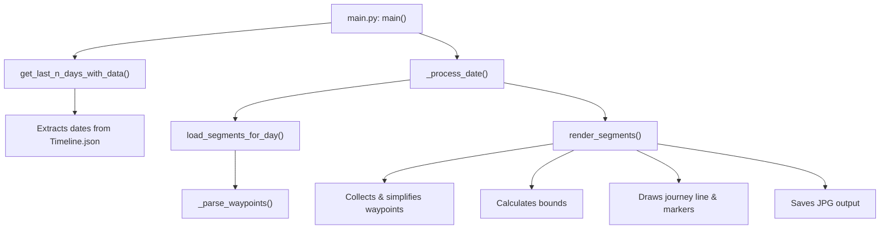
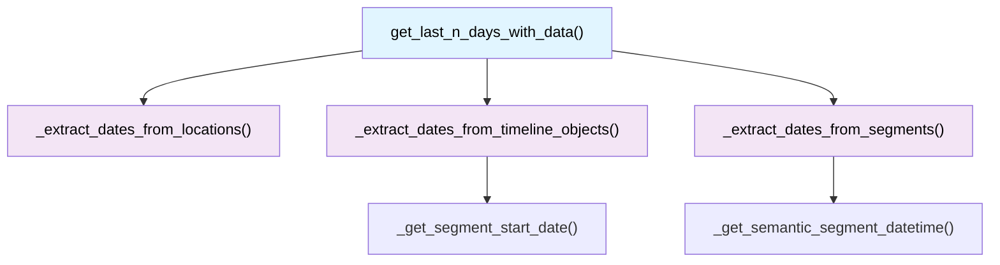
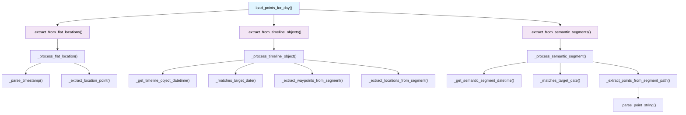
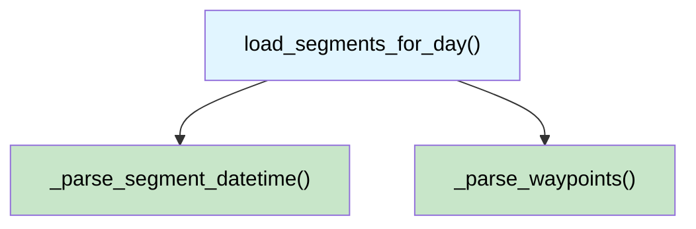
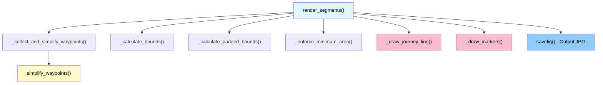
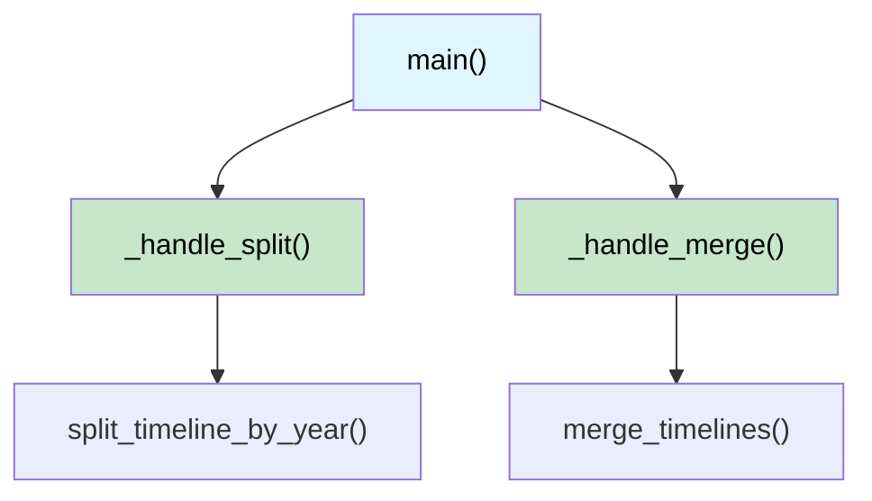
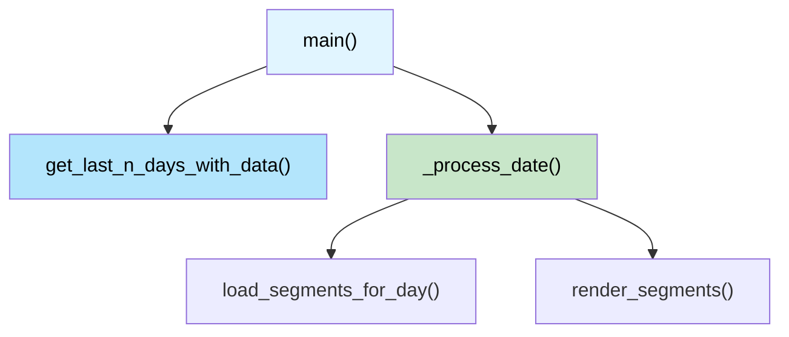
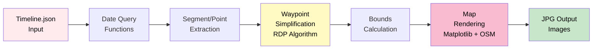

# Architecture & Function Flow

## Overview

This document shows the function relationships and data flow through the timeline-2-images application.

## Main Data Processing Flow

## Detailed Module Functions

### timeline_parser.py - Date & Segment Extraction

### timeline_parser.py - Point Extraction

### timeline_parser.py - Segment Loading

### map_renderer.py - Map Rendering Pipeline

### split_timeline.py - CLI & Timeline Splitting

### main.py - CLI & Orchestration

## Data Flow Architecture

## Function Complexity Hierarchy

**Tier 1 - Entry Points (A complexity)**
- `main()` - CLI orchestrator
- `main()` (split_timeline) - Timeline management CLI

**Tier 2 - Core Business Logic (A complexity)**
- `load_segments_for_day()` - Extract segments with waypoints
- `load_points_for_day()` - Extract individual points
- `get_last_n_days_with_data()` - Find dates with data
- `render_segments()` - Generate map images

**Tier 3 - Schema Handlers (A complexity)**
- `_process_flat_location()` - Handle flat location schema
- `_process_timeline_object()` - Handle timeline objects schema
- `_process_semantic_segment()` - Handle semantic segments schema

**Tier 4 - Utility Functions (A complexity)**
- `simplify_waypoints()` - RDP line simplification
- `_parse_timestamp()` - Timestamp parsing
- `_parse_waypoints()` - Waypoint coordinate parsing
- `_parse_point_string()` - String coordinate parsing
- Bounds calculation helpers

**All 39 functions maintain A complexity (≤ 5 cyclomatic complexity)**

## Key Design Patterns

1. **Data Pipeline**: Functions transform data sequentially without state
2. **Pure Functions**: Most functions have no side effects
3. **Schema Abstraction**: Three schema handlers for different Timeline JSON formats
4. **Single Responsibility**: Each function does one thing well
5. **Composition**: Small functions compose into larger workflows
